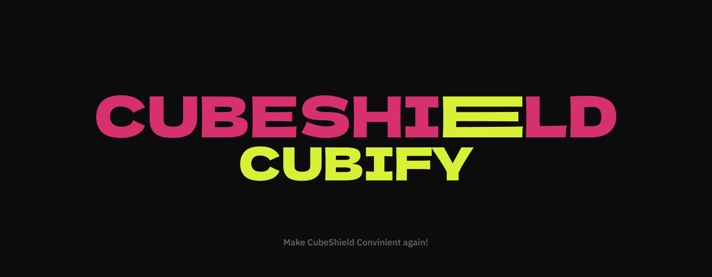

# `Cubify` ✨

[](https://go.dev)


Это самое крутое, что вы видели, а именно имбовейший лаунчер по майнкрафту для проектов **CubeShield** 😇😇😇

### ⚡️ **Если вы просто хотите играть, вам сюда** - **[Последний релиз!!!](https://github.com/CubeShield/Cubify/releases/latest)**

## `Почему это - имба?` 🔥


- **Теперь вы можете играть где хотите,** не важно с Windows, MacOS, Linux, вы будете получать одинаковый юзер экспириенс от использоания лаунчера

- **Это просто,** все что необходимо - скачать лаунчер, запустить его, войти в аккаунт (либо написать ник), выбрать сборку и нажать играть, скачивание майнкрафта и джавы берет на себя лаунчер

- **Работает всегда**, потому что все данные о сборках и их индексы хранятся на GitHub, а значит CubeShield не будет тратить никаких ресурсов на поддержание сторонних API, в придачу получаем крутую систему версионирования, релизов и чейнджлогов

- **прикольььььно**, ваще написано на стеке GoLang + TypeScript, что круто, дает крутую кроссплатформу и дешевизну разработки

- **Кастом сборок**, раньше было запарно добавить даже один модик, надо было лезть в папку сборки, скаивать и скидывать его, теперь просто вставьте ссылку Modrinth на мод формата `https://modrinth.com/mod/skinrestorer/version/2.6.0+1.21.11-fabric` с версией, а его установку лаунчер берет на себя, также и с CurseForge, либо если вы старовер, можете добавить мод, перетащив его

- **Настроечки**, в которых можно менять ОЗУ под джаву, тип сборки и много чего еще, просто зайдите туда

- **Режим разработки**, помимо всего функционала есть режим разработки, который упрощает разработки в сотни раз, для его работы нужен Git, а там уже можно разобраться, поддерживается деплой на сервер через FTP

## `Как это работает под капотом` 😇

В основе лежит две штуки `Instance` и `Index`

**Index** - обычный Git репозиторий, захощенный на GitHub, содержащий в себе `index.json`, который уже является этакой сборной солянкой всех сборок, по сути как список пакетов, доступный к установке

Репозиторий выглядит так

```bash
.
└── index.json
```

А сам `index.json`:

```json
{
    "provider_name": "CubeStudio Official", # Название источника
    "instances": ["CubeShield/CubeShieldX-Instance", "CubeShield/CubeShield8-Instance"] # Реопзитории Instance
}
```

Сам этот файлик береться напрямую из main ветки, все без релизов итд, то есть если мы говорим про то, где лежит индекс, то правильно будет сказать так: `https://raw.githubusercontent.com/CubeShield/CubeInstances/refs/heads/main/index.json`

В настройках по умолчанию именно такой и указан, как понятно, их может быть несколько, можно создать свой и передавать в нем ваши сборки

**Instance** - обычный Git репозиторий, захощенный на GitHub, содержащий в себе много интересного, по факту обычная сборка в нашем понимании

Обычный репозиторий выглядит так:

```bash
.
├── .github
│   └── workflows
│       └── release.yml # Воркфлоу для релизов
├── instance.json # Информация о сборке
├── logo.png # Фоточка
└── release_message.txt # Информация чейнджлога для релиза
```

Теперь копнем в `instance.json`, по сути это `Meta`, то есть здесь как бы храниться снапшот сборки

```json
{
  "name": "CubeShield X", # Название
  "description": "Здесь крутое описание", # Описание
  "loader": "fabric", # Загрузчик, можно и без него - ""
  "loader_version": "", # Версия загрузчика, можно и без - ""
  "minecraft_version": "1.20.1", # Версия майнкрафта
  "image_url": "https://raw.githubusercontent.com/CubeShield/CubeShieldX-Instance/main/logo.png", # Ссылка на фоточку
  "containers": [
    ...
  ]
}⏎
```

Новая сущность - **контейнеры**, проще говоря директория, которая простраивается из корня сборки, например

```bash
.
├── assets
├── bin
├── command_history.txt
├── config
├── data
├── defaultconfigs
├── downloads
├── editor
├── installed.json
├── instance.json
├── libraries
├── logs
├── mods # Этой
├── options.txt
├── realms_persistence.json
├── resourcepacks
├── saves
├── schematics
├── servers.dat
├── servers.dat_old
├── versions
├── villagerpacks
├── xaero
└── XaeroWaypoints_BACKUP240807
```

то если тип контента `mods`, то будет соответствовать здесь директории `./mods`

рассмотрим такой

```json
{
	"content_type": "mods", # Тип контента контейнера = директория
    "rewrite": false # WIP, полная перезапись контента каждый раз, даже если он не изменился, полезно для конфигов
	"content": [
		{
			"name": "Fabric API", # Отображаемое имя контента
			"image_url": "https://cdn.modrinth.com/data/P7dR8mSH/icon.png", # Ссылка на фоточку
			"type": "both", # Тип контента both/client/server
			"mod_id": "fabric-api", # ModID, если source modrinth/curseforge, для обновления модов
			"file_id": "0.141.3+1.21.11", # FileID, если source modrinth/curseforge, для обновления модов
			"source": "modrinth", # Источник мода modrinth/curseforge/local
			"file": "fabric-api-0.141.3+1.21.11.jar", # Название файла, в который будет сохранен контент в контейнере, например здесь mods/fabric-api-0.141.3+1.21.11.jar
			"url": "https://cdn.modrinth.com/data/P7dR8mSH/versions/i5tSkVBH/fabric-api-0.141.3%2B1.21.11.jar" # Ссылка на контент
		},
		{
			"name": "Create Fly",
			"image_url": "https://cdn.modrinth.com/data/dKvj0eNn/a1e1ad6f018c3a47cb300edbf0ebebce894bfd45_96.webp",
			"type": "both",
			"mod_id": "create-fly",
			"file_id": "1.21.11-6.0.9-5",
			"source": "modrinth",
			"file": "create-fly-1.21.11-6.0.9-5.jar",
			"url": "https://cdn.modrinth.com/data/dKvj0eNn/versions/fn0H9rSj/create-fly-1.21.11-6.0.9-5.jar"
		}
	],
    "containers": [ # WIP, вкладывание контейнеров в контейнер, например удобно в случае config/somemod/...
        ...
    ]
}
```

Данная система помогает легко доставлять контент на устройства и использовалась в **CLI обновлялке на Go ([CubeHopper](https://github.com/CubeShield/CubeHopper)**) в связке со старым **API на Python ([Cube-API](https://github.com/CubeShield/Cube-API)**), которая уже в свою очередь работало с **обновлялками на Kotlin** ([CubeRestart](https://github.com/CubeShield/CubeRestart)) и **Java** ([CubeStart](https://github.com/CubeShield/CubeStart))

Профитов много, система проста, это круто 👍


## `Что теперь?` 💅

Лаунчер в довольно неплохом состояни, есть минорные фиксы, всякие дополнения, но основное все готово, теперь остается с удобством и лютым кайфом пилить новые сезоны для КШ и так далее, короче ваще имбища, но все таки роадмапу здесь оставлю **xDDD**

- [ ] Индкесы не работают с первого раза
